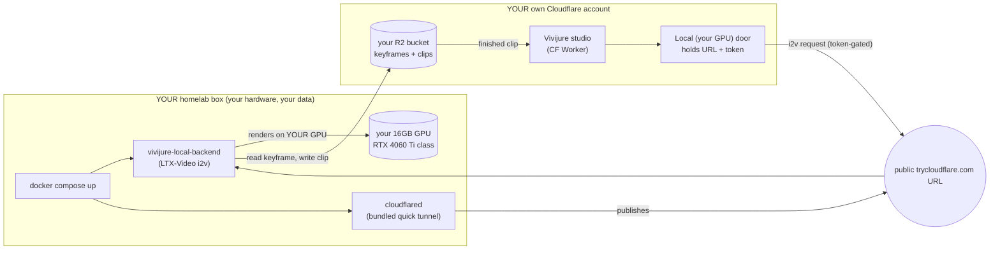

# Vivijure Local Backend

**The AI film studio backend you run yourself.**

Make films on a GPU you already own. This is the render engine behind [Vivijure](https://github.com/skyphusion-labs/vivijure) (the AI film studio), running image-to-video on a **single consumer GPU in your own homelab** -- a 16GB card (RTX 4060 Ti class) is the floor.

- **Your own GPU.** No cloud GPU, no rent, no per-render bill. Free after the hardware you already bought.
- **Your data never leaves your box.** Frames are rendered locally and reached over a private tunnel that terminates on your machine.
- **No SaaS, no account, no lock-in.** One command brings it up; you point your studio at it.

  

> **One studio, two honest doors.** Vivijure lets you pick where your clips render: rent a datacenter GPU by the second (the [RunPod door](https://github.com/skyphusion-labs/vivijure-backend), top quality ceiling, pay per render), or run it on silicon you already own (this door -- free, private, with a quality/resolution ceiling that scales with your card). Same studio, same controls. **You pick the door.** This is the honest local-vs-datacenter trade, not a race against a cloud product.

---

## Run it on your own box (one command)

**Prereqs (one time):** an NVIDIA GPU (16GB+, RTX 4060 Ti class), Docker, and the [NVIDIA Container Toolkit](https://docs.nvidia.com/datacenter/cloud-native/container-toolkit/latest/install-guide.html).

```sh
cp .env.example .env     # add your shared-R2 keys (one credential, required for real renders)
docker compose up
```

That is it. The first start downloads the model (about 10GB, once), brings up its own Cloudflare tunnel (no Cloudflare account, no networking knowledge), generates a token, and then prints a copy-paste banner the moment it is actually usable:

```
================================================================
  Vivijure local backend is LIVE

  Backend URL:    https://<random>.trycloudflare.com
  Backend token:  <auto-generated>

  -> Paste these into your Vivijure studio's "Local (your GPU)" door
     (LOCAL_BACKEND_URL + LOCAL_BACKEND_TOKEN). That is the whole setup.
================================================================
```

Paste those two values into your studio's **"Local (your GPU)"** door and start rendering. No tunnel to configure, no logs to grep, no Cloudflare login. If you ever want a stable address instead of the random one, that is a one-line upgrade ([below](#go-deeper-optional)).

---

## See it (a real clip, on a 16GB card)

A real image-to-video clip, animated end to end from a single keyframe on a 16GB consumer GPU. Not a placeholder.


*Standard tier, 704x512, rendered in about 2 minutes on a 16GB card.* Full-quality MP4s and the source keyframe live in [`docs/proof/`](docs/proof): [standard](docs/proof/sample_standard.mp4) | [draft (512x320)](docs/proof/sample_draft.mp4) | [the keyframe it started from](docs/proof/keyframe.png) | [end-to-end tunnel smoke clip](docs/proof/plumbing_tunnel_clip.mp4).

---

## Proven on the 16GB floor

Validated with a live benchmark on a 16GB Ada card (RTX 2000 Ada, the closest proxy for the RTX 4060 Ti 16GB target). Engine: LTX-Video i2v with model-CPU-offload + VAE tiling.

| tier | resolution | frames | peak VRAM | fits 16GB | sec/clip |
|---|---|---|---|---|---|
| `draft` | 512x320 | 97 (~4s) | **10.44 GB** | yes (~6GB headroom) | **38.6s** |
| `standard` | 704x512 | 121 (~5s) | **10.46 GB** | yes (~6GB headroom) | **125.6s** |

No OOM at either tier; about **6GB of headroom** on a 16GB card, so bigger cards have room to spare. Cold model load about 39.7s. Full write-up + the cost/hygiene log: **[docs/proof/RESULTS.md](docs/proof/RESULTS.md)**.

The honest trade: a 16GB card gives you a real, private, free-after-hardware render path with a **lower quality and resolution ceiling** than rented datacenter GPUs. `final` is your card's honest ceiling, not datacenter parity. When you want the top ceiling and will pay per render, the studio's RunPod door is right there. That is the point of two honest doors.

---

## What it runs

**[LTX-Video](docs/i2v-model-selection.md)**, chosen over CogVideoX / SVD / AnimateDiff for the 16GB floor on fit, speed, and license: the lightest real image-to-video model, few-step distilled (fast on a consumer card), and the cleanest license for a freely-given AGPL project. The three quality tiers map to LTX configs a 16GB card can honestly deliver.

---

## How it works (you self-host everything)



Every box in this diagram is **yours**: your GPU, your Cloudflare Worker, your R2 bucket. The studio sends a token-gated render request through your own tunnel; frames render on your hardware and the finished clip lands in your own storage. **Skyphusion Labs operates nothing here, and holds none of your data.**

---

## License

[AGPL-3.0-only](LICENSE). Vivijure Local Backend is software you self-host; if you run it as a network service for others, you must offer them the complete corresponding source under the same license, so it stays a commons. See [NOTICE](NOTICE) for the short version.

Self-hosting is the whole point: Skyphusion Labs operates nothing here, so we hold none of your data. Frames render on your hardware and clips land in your own storage.

A labor of love, given freely: use it, learn from it, self-host it, build your own creative visions on it. It is not for sale, and not to be resold as a SaaS.

**Acceptable use:** no CSAM and no non-consensual imagery, ever -- see [ACCEPTABLE-USE.md](ACCEPTABLE-USE.md).

---

## Go deeper (optional)

You already have the win above. These are here for when you are curious, not before:

- **[docs/HOMELABBER.md](docs/HOMELABBER.md)** -- the full walkthrough: prereqs, the honest trade-offs, quality tiers, a stable named-tunnel address, and troubleshooting.
- **[docs/INTEGRATION.md](docs/INTEGRATION.md)** -- wiring the Local door into the studio (the `local-gpu` module, secrets, the flip checklist).
- **[docs/architecture.md](docs/architecture.md)** -- "one studio, two honest doors" and how this backend is built.
- **[docs/i2v-model-selection.md](docs/i2v-model-selection.md)** -- the dry comparison behind picking LTX-Video.

### A stable address (named tunnel)

The default quick tunnel gives you a fresh random URL each run. For an address that survives restarts, set `TUNNEL_TOKEN` (a Cloudflare named-tunnel token) in your `.env`; the banner then shows your own hostname. Details in [docs/HOMELABBER.md](docs/HOMELABBER.md).

### The job API (RunPod-compatible)

A long-running server (`src/vivijure_local/server.py`) the studio's `local-gpu` module talks to exactly as the datacenter door talks to RunPod:

```
POST /run          { "input": { action: "i2v_clip", project, shot_id, prompt, keyframe_key?, config } } -> { "id" }
GET  /status/<id>  -> { id, status: IN_QUEUE|IN_PROGRESS|COMPLETED|FAILED, output?, error? }
POST /cancel/<id>  -> { ok: true }   (idempotent)
GET  /health       -> { ok: true, ... }
POST /run { "selftest": true } -> a no-GPU transport probe
```

The server runs one i2v job at a time (a consumer card renders serially) -- the RunPod-lifecycle stand-in for a box with no serverless platform.

### Develop (CPU: no GPU, no model weights)

```sh
python -m venv .venv && . .venv/bin/activate
pip install -r requirements-dev.txt
pytest                       # the full CPU suite (config, vram, frame math, jobs, server routing)
python -m py_compile src/vivijure_local/*.py
```

The pure logic is CPU-tested and green; the torch/diffusers generation body is deferred-imported and validated on the card. It raises a clear error rather than faking output if the GPU runtime is absent -- a producer stage never ships a fake clip.

### Security boundary

One credential: the shared-R2 key (read the keyframe, write the clip). The tunnel is public, so the i2v endpoint **hard-rejects any request without the token** (auto-generated if you leave it blank). Keep the backend reachable only through the tunnel. The backend holds no studio secrets and no submitter identity.

---

## Credits

Vivijure is built by Conrad ([@skyphusion](https://github.com/skyphusion)) and crew, a labor of love given freely:

- **Mackaye** -- PM / tech lead ([@skyphusion-mackaye](https://github.com/skyphusion-mackaye))
- **Strummer** -- infrastructure ([@skyphusion-strummer](https://github.com/skyphusion-strummer))
- **Rollins** -- backend / render engine ([@skyphusion-rollins](https://github.com/skyphusion-rollins))
- **Joan** -- frontend / studio UI ([@skyphusion-joan](https://github.com/skyphusion-joan))
- **Ernst** -- legal / licensing ([@skyphusion-ernst](https://github.com/skyphusion-ernst))

Named for the punks and players who taught us to do it ourselves.
