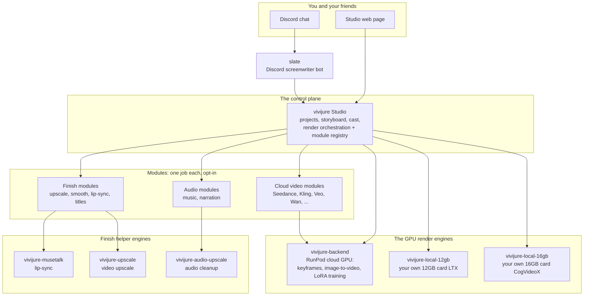

# vivijure-local-12gb

The **local-consumer** render backend for Vivijure: image-to-video on a **single consumer GPU** (a
**12GB floor, proven**; e.g. RTX 3060 12GB, RTX 4070, RTX 4070 Ti) running in your own homelab. The deliberate opposite of
[vivijure-backend](https://github.com/skyphusion-labs/vivijure-backend) (the RunPod datacenter engine,
Wan 2.2 on H200/B200).

**One studio, two honest doors.** The studio's `motion.backend` hook makes the clips engine pluggable.
The control plane is unchanged; the user picks the door: rent datacenter GPU, or run it on silicon they
already own. This backend is the second door -- no rent, no cloud GPU at all, reached over a Cloudflare
tunnel that terminates at the box.

```
control plane --> local-gpu module (CF Worker) --/run--> tunnel --> THIS backend (LTX-Video, 12GB consumer GPU)
```

## Where this fits: the constellation

Vivijure is not one program. It is a small group of programs that work together (we call the
whole group the **constellation**). The **Studio** is the control plane; it decides what runs and
hands the heavy render work to a GPU engine. This repo is one box on that map: the own-GPU local
render door. You choose it, and the render happens on the graphics card in your own computer.



**You are here:** vivijure-local-12gb is the own-GPU local render door (LTX, 12GB card).

The full map, the same one every constellation repo shows, and how to read it, is in
**[docs/constellation.md](docs/constellation.md)**.

## Run it on your own box (one command)

New box with nothing installed yet? Follow the from-scratch prerequisites (NVIDIA driver, Docker, the
NVIDIA Container Toolkit; one tested path, Ubuntu 24.04 LTS) in
**[docs/HOMELABBER.md](docs/HOMELABBER.md)**, then run `./preflight.sh` to confirm your box is ready
(it checks everything and installs nothing). Then:

```sh
cp .env.example .env         # then edit: your R2 creds (+ optional LOCAL_BACKEND_TOKEN)
docker compose up -d         # starts the server + its own tunnel (:8000 stays inside the compose network)
docker compose logs ready    # the banner: your Backend URL + token, copy-paste ready
```

`docker compose up` PULLS the prebuilt image from `ghcr.io/skyphusion-labs/vivijure-local-12gb:latest`
(no local build; that is the whole ease-of-install point). Prefer to build from source? Run
`docker compose up -d --build` instead and compose builds `deploy/Dockerfile` locally.

To update to a newer release, pull explicitly: `docker compose pull` then `docker compose up -d`.
The compose file pins `pull_policy: missing`, so once the image is cached it never re-pulls on its
own; that is deliberate (no surprise auto-updates), which is why moving to a new release is an
explicit step.

Your FIRST render downloads the LTX-Video weights (~10GB, once) into the models volume, so it takes
several extra minutes; later renders skip the download.

The stack opens its own Cloudflare tunnel; point your studio's `local-gpu` module at the banner's
URL + token. The full
homelabber walkthrough (prereqs, tunnel, honest trade-offs, troubleshooting) is
**[docs/HOMELABBER.md](docs/HOMELABBER.md)**; the studio-side wiring is
**[docs/INTEGRATION.md](docs/INTEGRATION.md)**.

Needs an NVIDIA GPU (12GB+), an NVIDIA driver 550 or newer (the runtime is CUDA 12.4), the
[NVIDIA Container Toolkit](https://docs.nvidia.com/datacenter/cloud-native/container-toolkit/latest/install-guide.html),
and about 25GB of free disk (a ~10GB container image + the ~10GB LTX weights).

Starting from a bare Ubuntu box? **[docs/HOMELABBER.md](docs/HOMELABBER.md)** has copy-paste
steps to install the driver, Docker, and the NVIDIA Container Toolkit before you run.

## Configuration (`.env`)

Copy `.env.example` to `.env` and fill it in. Every setting is an environment variable:

| Var | Required | Default | What it does |
|---|---|---|---|
| `R2_ACCOUNT_ID` / `R2_ACCESS_KEY_ID` / `R2_SECRET_ACCESS_KEY` | yes | -- | The one credential: the shared-R2 key (read the keyframe, write the clip). Scope it to the bucket. |
| `R2_BUCKET` | no | `vivijure` | The shared bucket name. |
| `LOCAL_BACKEND_TOKEN` | no | auto-generated | The bearer token every i2v request must carry (the tunnel is public). Blank => a strong one is generated and printed in the banner; set it for a stable token across restarts. |
| `TUNNEL_TOKEN` | no | quick tunnel | A Cloudflare named-tunnel token for a STABLE hostname (also needs the `docker-compose.override.yml` from HOMELABBER "A stable address"). Blank => a zero-config TryCloudflare quick tunnel (URL changes each restart). |
| `VIVIJURE_MAX_VRAM_GB` | no | full card | Cap the VRAM vivijure claims, in GB, when you share the card with other workloads. The backend pins torch to that fraction of the card at startup. Blank (or a value >= your card's size) => use the whole card. |

The full reference -- every `.env` value, every built-in setting, the ports, the volumes, and the
per-clip settings the Studio sends -- is in **[docs/CONFIGURATION.md](docs/CONFIGURATION.md)**. You
should never need to open the compose file or the source to learn what a knob does.

### How your Studio reaches this door

The wiring is the same whether you self-host the whole Studio or point a hosted one at your box: the
Studio stores this backend's tunnel URL (`LOCAL_BACKEND_URL`) and the matching token, and its
`local-gpu` module calls this backend directly. There is no shared, multi-tenant path -- your
backend serves only the Studio you hand its URL to. The full studio-side wiring (bindings, secrets,
and the ordered flip) is in **[docs/INTEGRATION.md](docs/INTEGRATION.md)**.

## What it runs

**LTX-Video**, selected over CogVideoX / SVD / AnimateDiff for the 12GB floor on fit + speed + license
(the dry comparison is [docs/i2v-model-selection.md](docs/i2v-model-selection.md)): the lightest real
i2v model, few-step distilled (fast on a consumer card), and the cleanest license for a freely-given
AGPL project. The three quality tiers map to LTX configs a 12GB card can honestly deliver -- `final` is
the card's honest ceiling, not datacenter parity. `draft` and `standard` run the base 2B i2v; `final`
runs the **13B-distilled** variant (via `LTXConditionPipeline`), paged per-layer to fit 12GB.

| Tier | Model | Resolution | Frames | Steps | Offload | Peak VRAM | sec/clip |
|---|---|---|---|---|---|---|---|
| `draft` | LTX-Video 2B | 512x320 | 97 | 25 | model | ~9.76 GB | 48.6s |
| `standard` | LTX-Video 2B | 704x512 | 121 (~5s) | 40 | model | ~9.78 GB | 132.0s |
| `final` | LTX 13B-distilled | 768x512 | 121 (~5s) | 10 | sequential | ~4.63 GB | 108.4s |

`draft` + `standard` peaks are measured under an 11GB allocator cap
([docs/proof/RESULTS.md](docs/proof/RESULTS.md)); `final`'s under a hard 12GB allocator cap
([docs/proof/BENCH-13B.md](docs/proof/BENCH-13B.md)). CPU offload + VAE tiling bound the base tiers'
peak flat, so the heavier base tier costs time, not VRAM.

> VALIDATED on the real shipped container. The base tiers (`draft` / `standard`, base 2B i2v) render with
> **NO OOM** at ~9.78GB peak reserved under an 11GB budget (`VIVIJURE_MAX_VRAM_GB=11` on a 15.7GB Ada
> card, cold load 34.4s), verified two ways: the engine directly AND the live `/run` + R2 path
> ([docs/proof/RESULTS.md](docs/proof/RESULTS.md)). The `final` tier (13B-distilled, few-step, via
> `LTXConditionPipeline`) is PROVEN to FIT a hard 12GB allocator cap at 4.63GB peak reserved (7.4GB
> headroom) and 108.4s/clip -- FASTER than `standard` because the distilled variant needs only 10 steps
> ([docs/proof/BENCH-13B.md](docs/proof/BENCH-13B.md)). A true-12GB-card confirmation run for `final` is
> still pending (parked): fit is proven under a hard allocator cap, not yet claimed on a physical 12GB card.

## The job API (RunPod-compatible)

A long-running server (`src/vivijure_local/server.py`) the `local-gpu` module talks to exactly as
`own-gpu` talks to RunPod:

```
POST /run          { "input": { action: "i2v_clip", project, shot_id, prompt, keyframe_key?, config } } -> { "id" }
GET  /status/<id>  -> { id, status: IN_QUEUE|IN_PROGRESS|COMPLETED|FAILED, output?, error? }
POST /cancel/<id>  -> { ok: true }   (idempotent)
GET  /health       -> { ok: true, ... }
POST /run { "selftest": true } -> a no-GPU transport probe
```

The server owns an in-process serial job registry (a consumer card runs one i2v job at a time), the
RunPod-lifecycle stand-in for a box with no serverless platform.

## Develop (CPU: no GPU, no model weights)

```bash
python -m venv .venv && . .venv/bin/activate
pip install -r requirements-dev.txt
pytest                       # the full CPU suite (config, vram, frame math, jobs, server routing)
python -m py_compile src/vivijure_local/*.py
```

The pure logic is CPU-tested and green; the torch/diffusers generation body is deferred-imported and
validated on the card. The body raises a clear error rather than faking output if the GPU runtime is
absent -- a producer stage never ships a fake clip.

## The benchmark (proof gate)

`scripts/benchmark.py` runs the LTX i2v engine across the three tiers on the card, capturing fit (peak
VRAM / OOM), speed (sec/clip), and a real sample clip per tier, then writes a report. It is **ready to
fire** the instant the hardware is chosen; it does NOT run without a GPU (the spend gate). See
[docs/live-benchmark-plan.md](docs/live-benchmark-plan.md) for the costed plan.

## Security boundary

One credential: the shared-R2 key (read the keyframe, write the clip). Input is control-plane-trusted
(the module only reaches the box through the studio's service binding + your tunnel). An optional
`LOCAL_BACKEND_TOKEN` is defense in depth on the tunnel origin. The backend holds no studio secrets and
no submitter identity.

## Who this is for

Homelab builders with a **12GB consumer GPU** (e.g. RTX 3060 12GB, RTX 4070) who want Vivijure image-to-video locally without RunPod rent.

**Vivijure Studio:** https://vivijure.com · **Welcome demo:** https://vivijure.skyphusion.org/welcome · **Skyphusion Labs:** https://skyphusion.org

## Support

Questions, bugs, or ideas? Start with this repo's [GitHub Issues](../../issues); see
[SUPPORT.md](SUPPORT.md) for how to ask and what to include. Found a security problem? Report it
privately per [SECURITY.md](SECURITY.md), never as a public issue.

## License

**AGPL-3.0-only.** A labor of love, given freely: use it, learn from it, self-host it, build your own
creative visions on it. Run it as a network service and the AGPL has you share your changes back, so it
stays a commons. It is not for sale, and not to be resold as a SaaS.

Licensed under AGPL-3.0-only. See [LICENSE](LICENSE).
